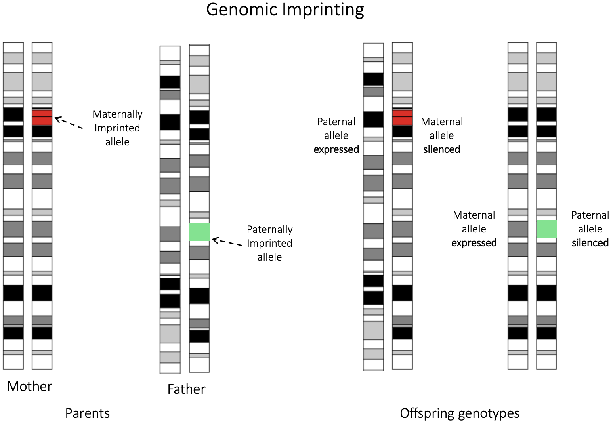
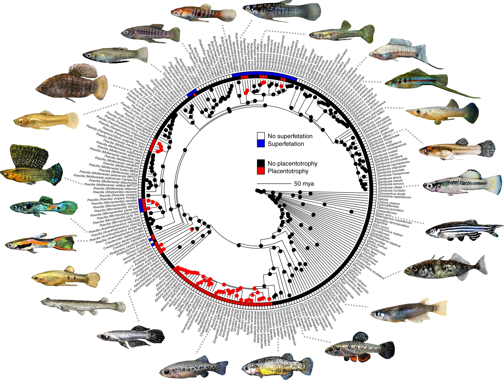
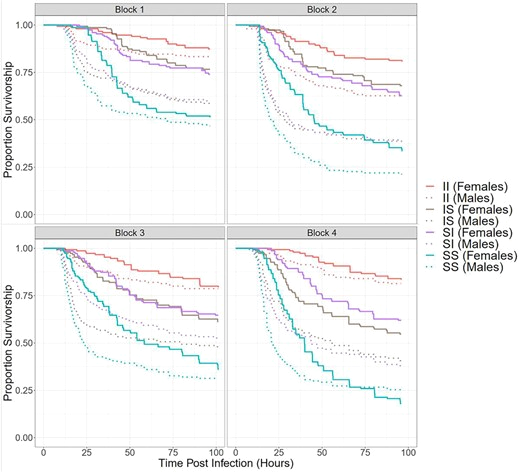
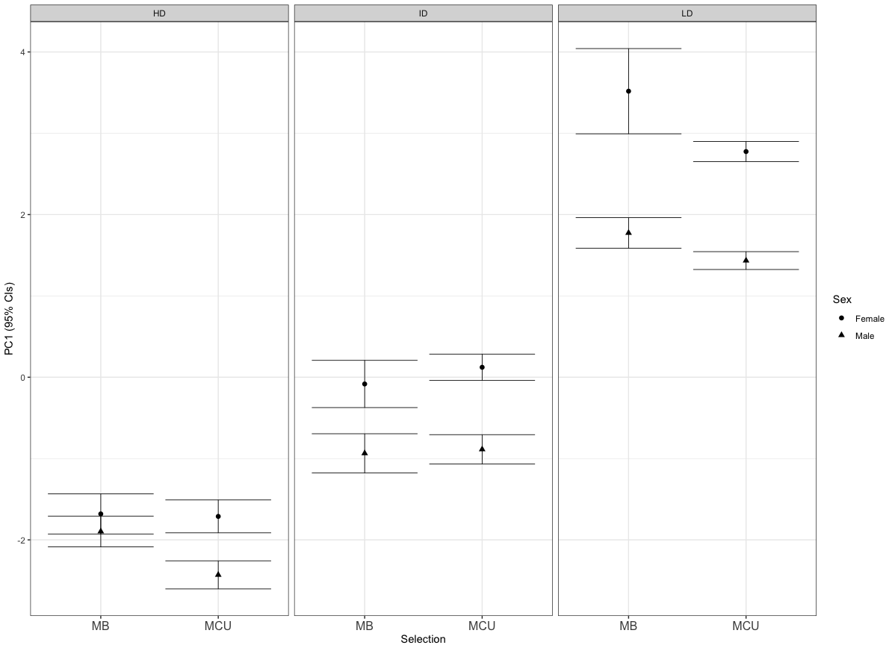

# Broader Interests
My research interests broadly lie in understanding the genetic basis of complex evolutionary processes like  speciation, sexual conflict, and the evolution of complex traits. My current research asks questions about the latter in context of intragenomic conflict associated with the evolution of vivparous matrotrophy in the livebearing fish family *Poeciliidae*. 
I am also interested in developing and applying computational, statistical, and machine learning methods for analyzing large-scale genomic and phenotypic data.

# Selected Research Projects
## Intragenomic conflict associated with evolution of viviparous matrotrophy

**Evolution of increased multiple paternity associated with viviparous matrotrophy**

Evolution of viviparous matrotrophy is predicted to shift the landscape of sexual conflict acting on a species and subsequently increase levels of multiple paternity. Using controlled breeding assays and high-throughput sequencing based pedigree analysis in two closely related poeciliid species *Heterandria formosa* and *Poecilia reticulata*, I have empirically demonstrated elevated multiple paternity as a consequence of variation in mode of maternal provisioning.

```{=html}
<figure class="ped-figure">
  <div class="ped-pair">
    <div class="ped-item">
      <div class="ped-panel" data-ped="PEDIGREE"
           data-ped-label="Pedigree network of a Heterandria formosa breeding design: 14 dams and 15 sires linked to 572 offspring."></div>
      <p class="ped-name"><em>Heterandria formosa</em><br>
        14 dams, 15 sires, 572 offspring</p>
    </div>
    <div class="ped-item">
      <div class="ped-panel" data-ped="PEDIGREE_GUPPY"
           data-ped-label="Pedigree network of a Poecilia reticulata breeding design: 9 dams and 17 sires linked to 246 offspring."></div>
      <p class="ped-name"><em>Poecilia reticulata</em><br>
        9 dams, 17 sires, 246 offspring</p>
    </div>
  </div>
  <div class="ped-legend" aria-hidden="true">
    <span class="ped-key is-dam">Dam</span>
    <span class="ped-key is-sire">Sire</span>
    <span class="ped-key is-off">Offspring</span>
  </div>
  <figcaption>
    Reconstructed pedigrees from the two breeding designs, with dams and sires
    sized by brood. Hover or tap an individual to light up its family.
  </figcaption>
</figure>
<script src="assets/pedigree-data.js"></script>
<script src="assets/pedigree-guppy.js"></script>
<script src="assets/pedigree-figure.js"></script>
```
Some of the ongoing work in this project includes investigating multiple paternity in wild populations at a macroevolutionary scale. We have generated ddrad sequencing data for 6 species of poeciliids that vary in reproductive mode and are currently analyzing the data to estimate levels of multiple paternity.

::: {.figure-inset}
{alt="Chromosome pairs of a mother and father, each carrying one imprinted allele, and the resulting offspring genotypes in which the imprinted copy is silenced."}
:::
\newline


**Parent-of-origin effects (genomic imprinting) in matrotrophic livebearing fishes**

Genomic imprinting is a genetic phenomenon whereby the expression of an allele is dependent on its parent of origin. Matrotrophic livebearing fishes are predicted to be a hotspot for the evolution of genomic imprinting because they have potential interactions between fetus and mother during gestation combined with an expectaion of evolutioary conflcits over optimal maternal provisioning. Current projects include investigating latter using phased genomic data, bulk transcriptomic data and offspring mass at birth data to get quantitative estimates of maternal provisioning.

## Post-copulatory sexual selection in Poeciliid fishes

**Phylogenetic comparative analysis of sperm competition in Poeciliids**

```{=html}
<figure class="figure-inset is-right">
  <a class="fig-zoom" href="assets/phylogeny.webp">
    
  </a>
  <figcaption>
    Poeciliid phylogeny. Figure from Furness et al. (2019),
    <em>Nature Communications</em> 10:3335. Licensed under
    <a href="https://creativecommons.org/licenses/by/4.0/">CC BY 4.0</a>.
  </figcaption>
</figure>
```

Poeciliid fishes have gotten a lot of attention from researchers studying Pre-copulatory sexual selection because of diversity of reproductive traits, sexual ornamentaion and mating behaviors. However, post-copulatory sexual selection has received less attention in this group despite sexual conflict hypotheses predicting interesting patterns of evolution in post-copulatory traits. My colleages and I have generated a dataset of sperm competitve traits for more than 30 species belonging to this family along with a phylogeny and are currently analyzing the data to test for patterns of evolution in post-copulatory traits.

## Experimental evolution using lab selected lines of *Drosophila melanogaster* 

Some of my earlier work has been focused on understanding fundamental questions in evolutionary biology using experimental evolution in *Drosophila melanogaster* using lab selected lines. I have used these lines to investigate:

- Resource limitation and its effects on evolution of sexually dimorphic traits and life history traits in crowding adapted populations. 
- Sex-specific dominance for surviving *Pseudomonas entomophila* infection in lab selected lines of *Drosophila melanogaster*.
- Genetic basis of improved survival to *Pseudomonas entomophila* infection in lab selected lines of *Drosophila melanogaster* using population genetics, HMM selection scans and functional genomics approaches.

```{=html}
<figure class="figure-row">
  <div class="figure-row-items">
    <a class="fig-zoom" href="assets/dros1.png">
      
    </a>
    <a class="fig-zoom" href="assets/dros2.png">
      
    </a>
  </div>
  <figcaption>Selected results figures</figcaption>
</figure>
```
