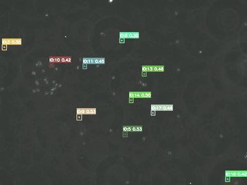
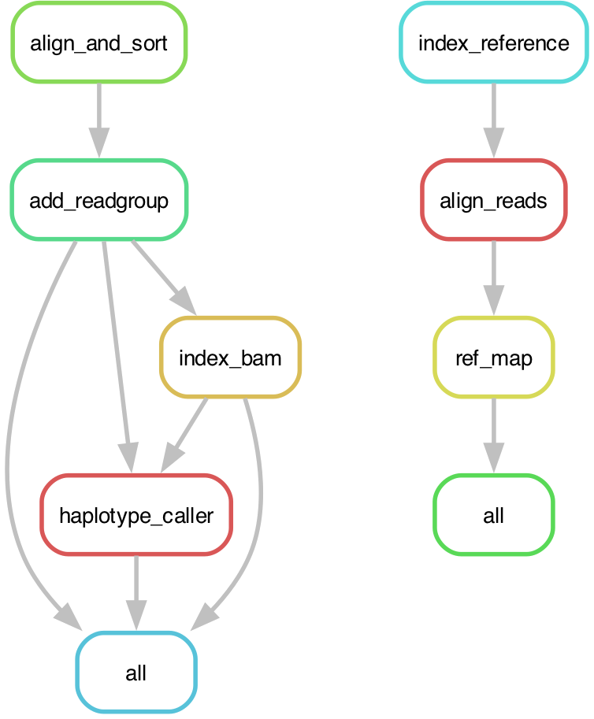

The projects below are the computational side of my research: computer vision
models, cluster workflows, and analysis pipelines written to take raw imaging
and sequencing data through to results that can be reproduced. Code for each is
on GitHub.

## Automated cell tracking {.project}

```{=html}
<figure class="clip-inset">
  
  <figcaption>Detection, identity assignment and per cell trajectories in phase
  contrast video of motile sperm.</figcaption>
</figure>
```

Manual annotation remains the bottleneck for phenotyping high-throughput
imaging data in ecology and evolution. To automate that step, I built a
computer vision framework around YOLOv8 covering object detection, instance
segmentation and multi-object tracking, trained on organismal imaging data
rather than on benchmark image sets. The repository carries pre-trained models
with worked Jupyter notebooks: sperm motility, where each cell is tracked
across frames and its path converted into CASA-style motility metrics,
spermatophore area by instance segmentation of brightfield images, and
stickleback swimming biomechanics. Training runs are scripted for GPU nodes
under SLURM.

```{=html}
<div class="repo-links">
  <a class="repo-btn" href="https://github.com/mkash006/vision-ML-methods-for-quantitative-biologists">
    <svg xmlns="http://www.w3.org/2000/svg" width="16" height="16" fill="currentColor" viewBox="0 0 16 16" aria-hidden="true"><path d="M8 0C3.58 0 0 3.58 0 8c0 3.54 2.29 6.53 5.47 7.59.4.07.55-.17.55-.38 0-.19-.01-.82-.01-1.49-2.01.37-2.53-.49-2.69-.94-.09-.23-.48-.94-.82-1.13-.28-.15-.68-.52-.01-.53.63-.01 1.08.58 1.23.82.72 1.21 1.87.87 2.33.66.07-.52.28-.87.51-1.07-1.78-.2-3.64-.89-3.64-3.95 0-.87.31-1.59.82-2.15-.08-.2-.36-1.02.08-2.12 0 0 .67-.21 2.2.82.64-.18 1.32-.27 2-.27s1.36.09 2 .27c1.53-1.04 2.2-.82 2.2-.82.44 1.1.16 1.92.08 2.12.51.56.82 1.27.82 2.15 0 3.07-1.87 3.75-3.65 3.95.29.25.54.73.54 1.48 0 1.07-.01 1.93-.01 2.2 0 .21.15.46.55.38A8.01 8.01 0 0 0 16 8c0-4.42-3.58-8-8-8"></path></svg>
    GitHub
  </a>
</div>
```

## Snakemake pipelines {.project}

To keep sequencing analyses restartable and reproducible on a cluster, I write
them as [Snakemake](https://doi.org/10.12688/f1000research.29032.2) workflows,
with sample discovery, per rule resources and SLURM submission all handled from
one config file. Two are public. The first follows GATK best practices for
GRAS-Di reads: BWA-MEM alignment with inline read groups, read group repair and
indexing, per sample GVCFs from HaplotypeCaller, then joint genotyping through
GenomicsDBImport and GenotypeGVCFs. The second processes ddRAD data by indexing
the reference, aligning with BWA-MEM and calling genotypes at RAD loci with the
Stacks `ref_map.pl` pipeline.

```{=html}
<figure class="figure-wide">
  <a class="fig-zoom" href="assets/snakemake_rulegraphs.png">
    
  </a>
  <figcaption>Rule graphs for the two workflows: GATK joint variant calling
  (left) and Stacks ddRAD reference mapping (right).</figcaption>
</figure>

<div class="repo-links">
  <a class="repo-btn" href="https://github.com/mkash006/grasdi_snpcall">
    <svg xmlns="http://www.w3.org/2000/svg" width="16" height="16" fill="currentColor" viewBox="0 0 16 16" aria-hidden="true"><path d="M8 0C3.58 0 0 3.58 0 8c0 3.54 2.29 6.53 5.47 7.59.4.07.55-.17.55-.38 0-.19-.01-.82-.01-1.49-2.01.37-2.53-.49-2.69-.94-.09-.23-.48-.94-.82-1.13-.28-.15-.68-.52-.01-.53.63-.01 1.08.58 1.23.82.72 1.21 1.87.87 2.33.66.07-.52.28-.87.51-1.07-1.78-.2-3.64-.89-3.64-3.95 0-.87.31-1.59.82-2.15-.08-.2-.36-1.02.08-2.12 0 0 .67-.21 2.2.82.64-.18 1.32-.27 2-.27s1.36.09 2 .27c1.53-1.04 2.2-.82 2.2-.82.44 1.1.16 1.92.08 2.12.51.56.82 1.27.82 2.15 0 3.07-1.87 3.75-3.65 3.95.29.25.54.73.54 1.48 0 1.07-.01 1.93-.01 2.2 0 .21.15.46.55.38A8.01 8.01 0 0 0 16 8c0-4.42-3.58-8-8-8"></path></svg>
    grasdi_snpcall
  </a>
  <a class="repo-btn" href="https://github.com/mkash006/Snakemake_ddrad">
    <svg xmlns="http://www.w3.org/2000/svg" width="16" height="16" fill="currentColor" viewBox="0 0 16 16" aria-hidden="true"><path d="M8 0C3.58 0 0 3.58 0 8c0 3.54 2.29 6.53 5.47 7.59.4.07.55-.17.55-.38 0-.19-.01-.82-.01-1.49-2.01.37-2.53-.49-2.69-.94-.09-.23-.48-.94-.82-1.13-.28-.15-.68-.52-.01-.53.63-.01 1.08.58 1.23.82.72 1.21 1.87.87 2.33.66.07-.52.28-.87.51-1.07-1.78-.2-3.64-.89-3.64-3.95 0-.87.31-1.59.82-2.15-.08-.2-.36-1.02.08-2.12 0 0 .67-.21 2.2.82.64-.18 1.32-.27 2-.27s1.36.09 2 .27c1.53-1.04 2.2-.82 2.2-.82.44 1.1.16 1.92.08 2.12.51.56.82 1.27.82 2.15 0 3.07-1.87 3.75-3.65 3.95.29.25.54.73.54 1.48 0 1.07-.01 1.93-.01 2.2 0 .21.15.46.55.38A8.01 8.01 0 0 0 16 8c0-4.42-3.58-8-8-8"></path></svg>
    Snakemake_ddrad
  </a>
</div>
```

## Population ancestry, admixture and paternity analysis {.project}

To assign paternity from high density SNP data, this pipeline takes a joint
genotyped cohort of *Poeciliopsis prolifica* from raw variant calls to a
validated pedigree. Panel curation walks 5.9 million raw sites down to 14,899
well spaced, common, biallelic SNPs, recorded mothers are confirmed and sires
assigned by opposing homozygote exclusion, and paternity is then quantified
across experimental crosses between two source populations. Every assignment is
checked against an independent line of evidence, a genomic hybrid index and
admixture estimate per individual, which is also what flagged a mislabelled
founder. Written in bash, Python and R, with each stage documented in its own
file.

```{=html}
<div class="repo-links">
  <a class="repo-btn" href="https://github.com/mkash006/P_prolifica_artificialinsemexp">
    <svg xmlns="http://www.w3.org/2000/svg" width="16" height="16" fill="currentColor" viewBox="0 0 16 16" aria-hidden="true"><path d="M8 0C3.58 0 0 3.58 0 8c0 3.54 2.29 6.53 5.47 7.59.4.07.55-.17.55-.38 0-.19-.01-.82-.01-1.49-2.01.37-2.53-.49-2.69-.94-.09-.23-.48-.94-.82-1.13-.28-.15-.68-.52-.01-.53.63-.01 1.08.58 1.23.82.72 1.21 1.87.87 2.33.66.07-.52.28-.87.51-1.07-1.78-.2-3.64-.89-3.64-3.95 0-.87.31-1.59.82-2.15-.08-.2-.36-1.02.08-2.12 0 0 .67-.21 2.2.82.64-.18 1.32-.27 2-.27s1.36.09 2 .27c1.53-1.04 2.2-.82 2.2-.82.44 1.1.16 1.92.08 2.12.51.56.82 1.27.82 2.15 0 3.07-1.87 3.75-3.65 3.95.29.25.54.73.54 1.48 0 1.07-.01 1.93-.01 2.2 0 .21.15.46.55.38A8.01 8.01 0 0 0 16 8c0-4.42-3.58-8-8-8"></path></svg>
    GitHub
  </a>
</div>
```

## Genome wide association and parent-of-origin effects {.project}

To test whether an allele acts differently depending on which parent
transmitted it, parental origin has to be resolved allele by allele. This
pipeline does that for a three generation sib mating design in *Heterandria
formosa*. Genotypes are masked on depth and quality before any site level
metric is computed, then split into a phasing panel and an association panel
with their own frequency and call rate cuts. Half sib families are phased per
linkage group with `hsphase`, and the phased matrices feed four analyses: a
parent-of-origin scan, an additive GWAS run as a control, REML heritability
against a genomic relationship matrix, and an inbreeding depression regression.
Significance is calibrated by permutation throughout, sign flipping the
parent-of-origin codes for the POE scan and shuffling phenotype within brood
for the additive scan, so that relatedness and family structure are preserved
under the null.

```{=html}
<div class="repo-links">
  <a class="repo-btn" href="https://github.com/Reznick-Lab/poe_gwas_birthmass_hformosa">
    <svg xmlns="http://www.w3.org/2000/svg" width="16" height="16" fill="currentColor" viewBox="0 0 16 16" aria-hidden="true"><path d="M8 0C3.58 0 0 3.58 0 8c0 3.54 2.29 6.53 5.47 7.59.4.07.55-.17.55-.38 0-.19-.01-.82-.01-1.49-2.01.37-2.53-.49-2.69-.94-.09-.23-.48-.94-.82-1.13-.28-.15-.68-.52-.01-.53.63-.01 1.08.58 1.23.82.72 1.21 1.87.87 2.33.66.07-.52.28-.87.51-1.07-1.78-.2-3.64-.89-3.64-3.95 0-.87.31-1.59.82-2.15-.08-.2-.36-1.02.08-2.12 0 0 .67-.21 2.2.82.64-.18 1.32-.27 2-.27s1.36.09 2 .27c1.53-1.04 2.2-.82 2.2-.82.44 1.1.16 1.92.08 2.12.51.56.82 1.27.82 2.15 0 3.07-1.87 3.75-3.65 3.95.29.25.54.73.54 1.48 0 1.07-.01 1.93-.01 2.2 0 .21.15.46.55.38A8.01 8.01 0 0 0 16 8c0-4.42-3.58-8-8-8"></path></svg>
    GitHub
  </a>
</div>
```
